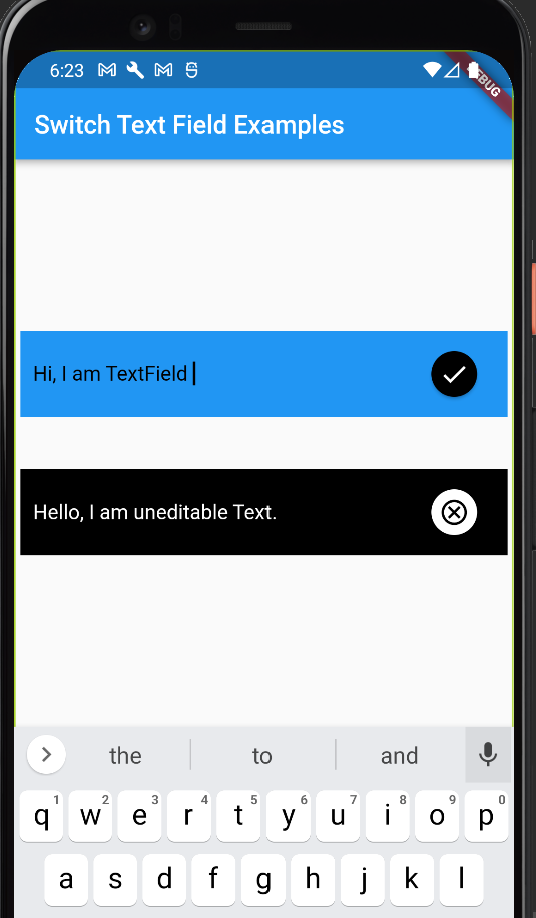

<!--
This README describes the package. If you publish this package to pub.dev,
this README's contents appear on the landing page for your package.

For information about how to write a good package README, see the guide for
[writing package pages](https://dart.dev/guides/libraries/writing-package-pages).

For general information about developing packages, see the Dart guide for
[creating packages](https://dart.dev/guides/libraries/create-library-packages)
and the Flutter guide for
[developing packages and plugins](https://flutter.dev/developing-packages).
-->

It is a UI element for a unique text field which can switch to uneditable text widget on icon click and vice versa.
It is build over general `TextField` and `Text` widget along with icons that helps in switching between two states.

## Features


## Getting started

To use this plugin, add `switch_text_field` as a dependency in your pubspec.yaml file.

## Usage

You can import the package with:

```dart
import 'package:switch_text_field/switch_text_field.dart';
```


Use it as follows:

### Material Example 1:
```dart
SwitchTextField(),
```
Above code will build widget with default parameters, though their are some customizable properties like text_color, icon_color, background_color, icon_background_color, text_icon, text_field_icon etc.

### Material Example 2:
```dart
SwitchTextField(  
  background_color: Colors.black,  
  icon_color: Colors.black,  
  icon_background_color: Colors.white,  
  text_color: Colors.white,  
  isEditing: false,  
  text_icon: Icons.cancel_outlined,  
  text_field_icon: Icons.add,  
  text_field_hint: "Enter title... ",  
),
```
In the code above, the some customizable properties allows us to change colors, icons and text properties for the widget[Details below].

## Parameters

`background_color` : `[Color]`  Background color for the container.

`icon_color` : `[Color]`Color for the icon.

`icon_background_color` : `[Color]`Background color for icon button.

`text_color` : `[Color]`Color for the text.

`font_size` : `[Double]`Font size for the text and text field.

`text_field_hint` : `[String]`Hint for the text field to be shown at the initial.

`text_field_icon` : `[IconData]`Icon to be shown along text field.

`text_icon` : `[IconData]`Icon to be shown along uneditable text.

`isEditing` : `[Bool]`Current state of the widget: true means TextField is editable otherwise false means non-editable content.


## How you can help
[Contribution Guidelines](https://github.com/codeSG/switch_text_field/blob/master/CONTRIBUTING_GUIDE.md)
